## An Uninteresting Slide

* An uninteresting bullet point.
* Hopefully, things improve...

## 1968

## Seventh-Grade Project

::: notes
* Simple components
* Shows what-connects-to-what
* Left-to-right signal flow
* Clear circuit function
:::

## Effort vs. Clarity

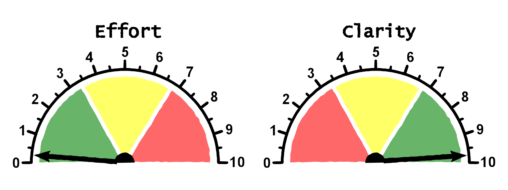

::: notes
Dick and Jane Primer
:::

## 1975

## Opamp

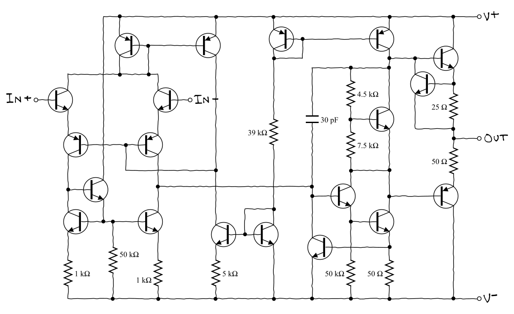

::: notes
But doesn't this schematic look nice?

* Simple components
* Shows what connects to what.
* left-to-right signal flow
* Clear circuit function:
    + Differential input stage
    + Level shifters
    + Totem-pole output driver
:::

## Effort vs. Clarity

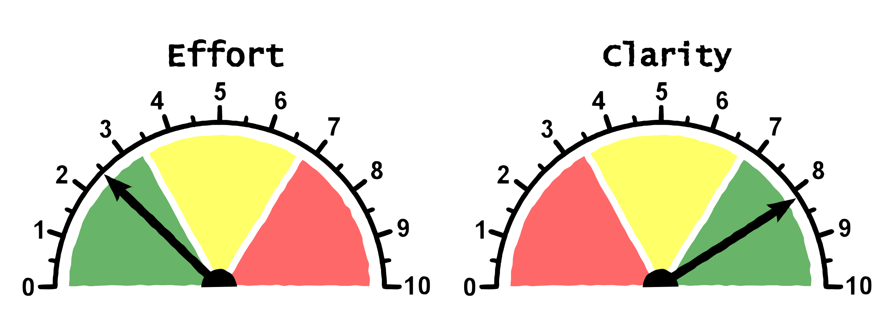

## 1981

## Microprocessor

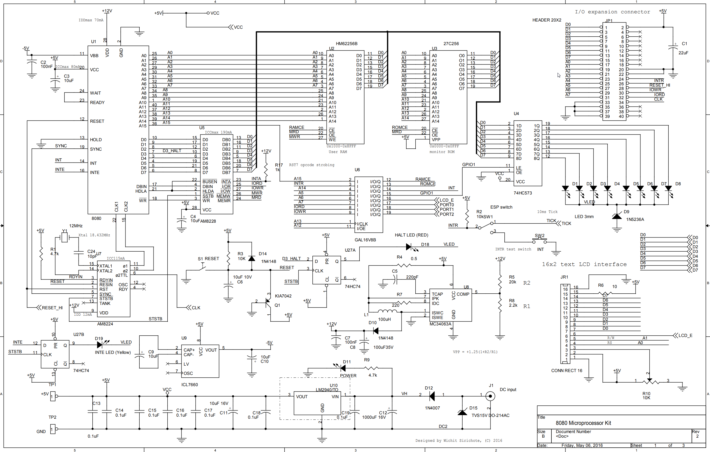

::: notes
* Tells what-connects-to-what
* Complex components with some well-defined I/O
* Back-and-forth signal flow between processor and memory
* Circuit function is hidden in software
:::

## Effort vs. Clarity

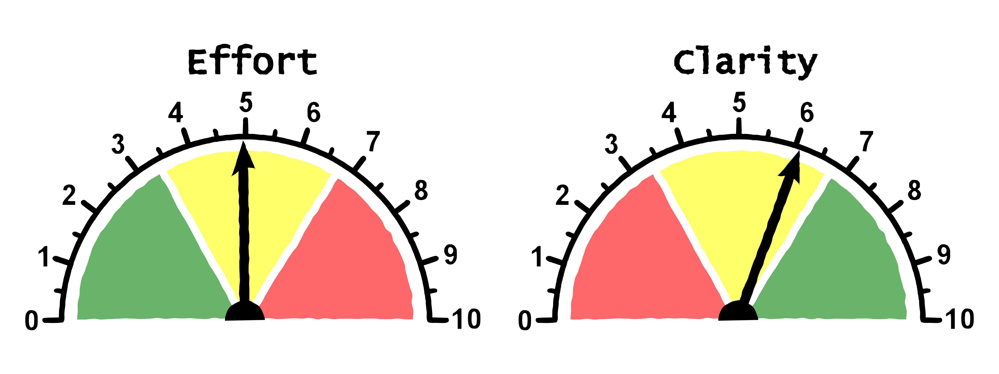

::: notes
Tom Clancy novel: Complicated interconnections between generic parts with hidden intentions.
:::

## 1995

## 80486 Motherboard

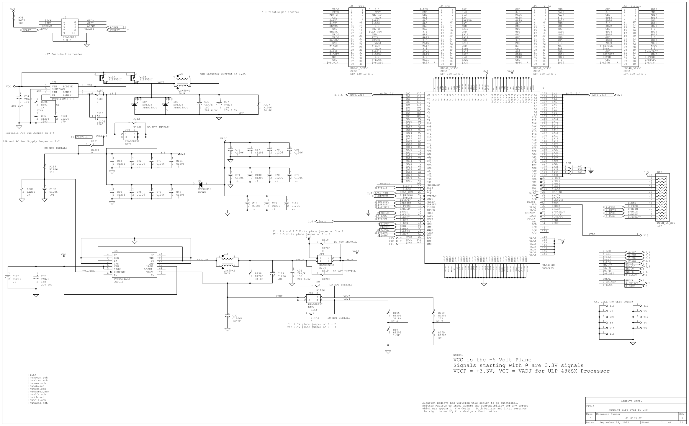

::: notes
* Main processor.
:::

## 80486 Motherboard (cont'd)

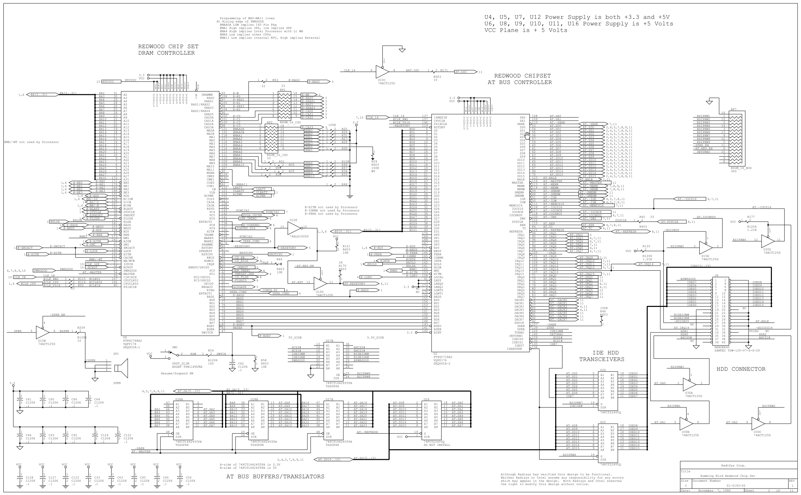

::: notes
* North and South bridges.
* 15 more pages of this stuff.
:::

## Effort vs. Clarity

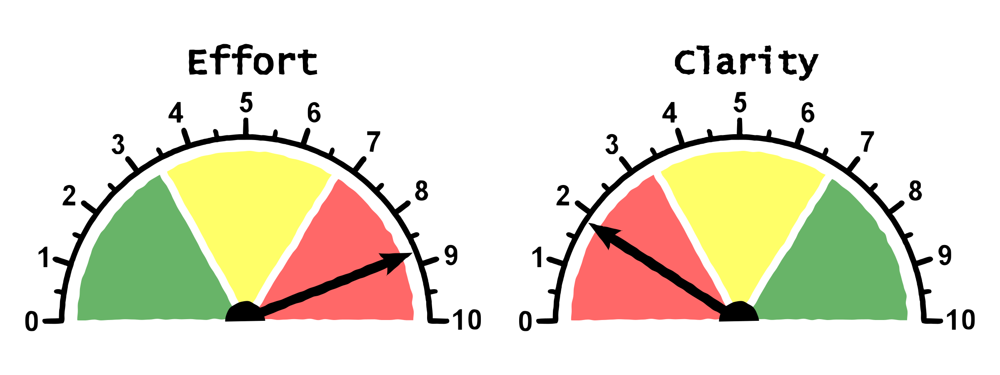

::: notes
Like Stephen King's "The Stand": long and leaves you with a feeling of horror.
:::

	
## 2000 and Beyond

## SOCs, FPGAs, Oh My!

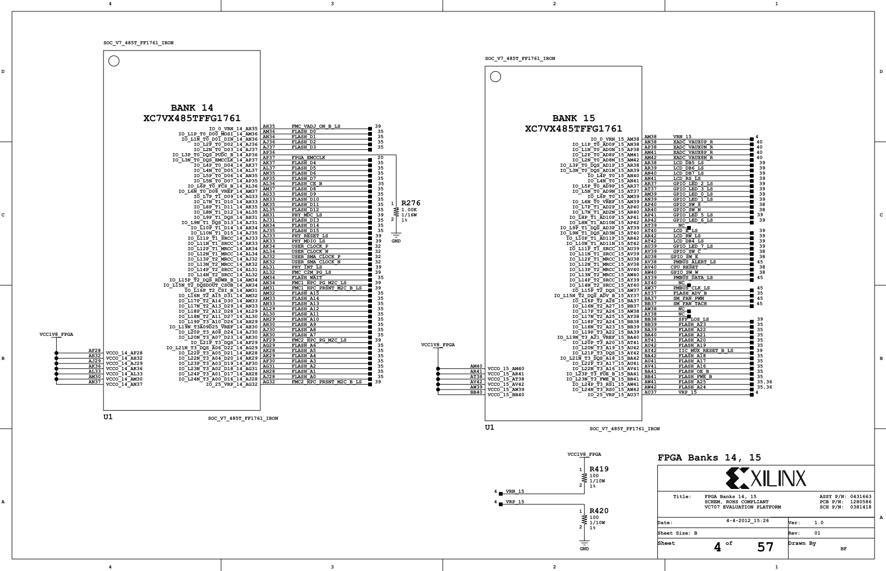

::: notes
* 2000-pin devices
* Massive integration of analog/digital blocks
* Wide buses / serial buses / packet comms
* Tells what-connects-to-what
* Too many wires => use stubs and labels
* Circuit function is no longer depictable
:::

## SOCs, FPGAs, Oh My! (cont'd)

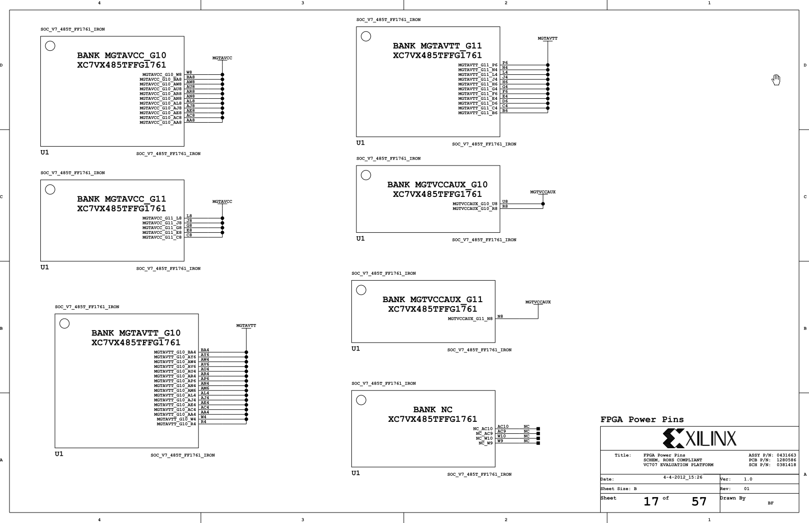

## SOCs, FPGAs, Oh My! (cont'd)

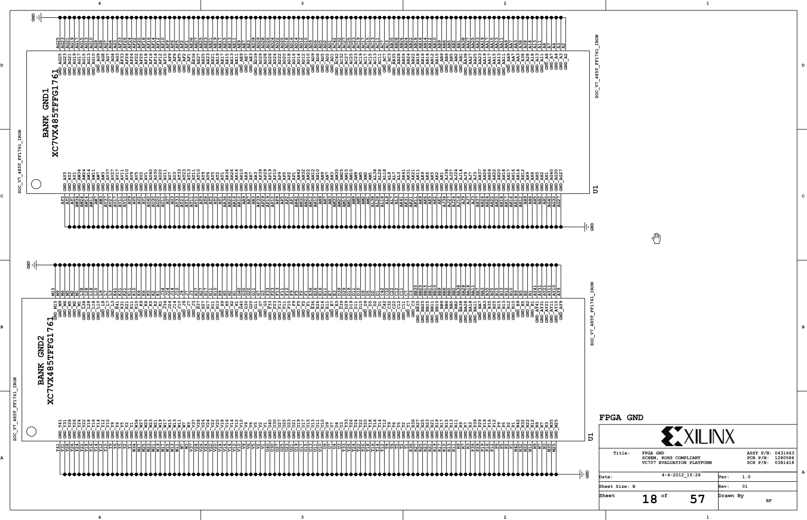

## SOCs, FPGAs, Oh My! (cont'd)

## Effort vs. Clarity

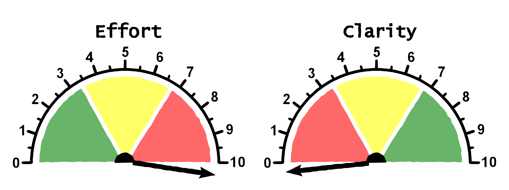

::: notes
Like James Joyce's "Finnigans Wake": only the author understands it and nobody else has gotten past page three.
:::

## The Progression

* Started small and things worked great!
* Used a bit more, still OK.
* Used even more. Marginal results.
* Using heavily. No longer sure what's going on...

::: notes
* Similar to a drug addiction.
:::

## 

&nbsp;

<section id="schematics-heroin-title" class="slide level2" data-background="schematics_heroin_title.png">
</section>

## 2016

forum.kicad.info/t/pcbnew-without-eeschema-again/3306

"I’d like to create ... netlist information from non-graphical tools..."

* Typing is faster than drawing
* Computers handle text efficiently
* Every OS has a text editor
* Scripts can automate tasks
* Searching is straightforward

::: notes
* Original poster: Alex Lopez (alez).
* Such a good idea! Has it been done before?
:::

## It's Been Done Before

* PHDL
* BYU
* Java

::: notes
* But it died!
:::

## But PHDL Died

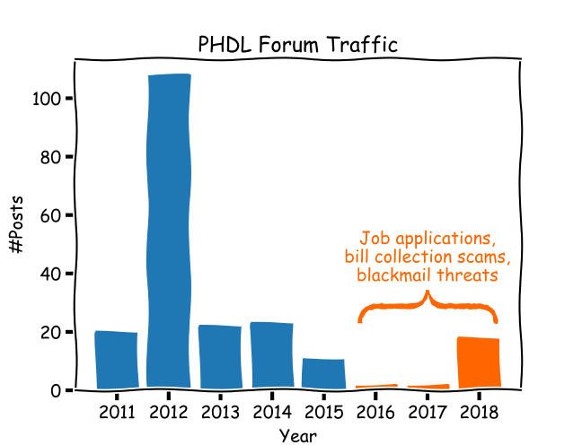

::: notes
* As judged by forum traffic.
* https://sourceforge.net/p/phdl/mailman/phdl-devel/?viewmonth=201506
* Since the dawn of time, scavengers have learned the value of dead things...
:::

## Tasty and Doesn't Fight Back!

## PHDL - the Tasty Bits

* Concise, repetitive part instantiation
* Concise, bulk connectivity
* Encapsulation
* Hierarchy

::: notes
If it's dead, better nose it to find out why...
:::

## Why Did PHDL Die?

* Very problem-specific
* Lacked general-purpose capabilities
* No ecosystem (libraries, utilities)
* No user community

::: notes
It's like a little girl in the desert.
:::

## 

::: notes
She's wandered way out into the desert and now she's sad nobody is around to play with her merry-go-round.
But nobody will come all the way out into the desert just to play with a toy merry-go-round.
Except this guy.
:::

## 

::: notes
* Except this guy!
* How to correct these shortcomings of PHDL???
:::

## MyHDL

* Built upon a general-purpose language: Python
* Adds objects for describing digital hardware
* Provides a functional simulation engine
* Outputs VHDL or Verilog for synthesis

## PHDL + MyHDL &rarr; SKiDL

* Use Python for general-purpose computing
* Add *part* and *net* objects
* Provide methods for connecting them
* Output a netlist to PCBNEW

## Basic SKiDL Objects

* `Pin`: a terminal with a number, name, I/O type, ...
* `Part`: a bag of `Pin`s
* `Net`: a connection between one or more `Pin`s
* `Bus`: an array of `Net`s

## Start With a Part

<pre class="fragment sourceCode py"> >>> uc = Part('MCU_Microchip_PIC10', 'PIC10F220-IP')</pre>

<pre class="fragment sourceCode py"> >>> uc</pre>

<pre class="fragment sourceCode py" style="color:lime">PIC10F220-IP (PIC10F222-IP): 512W Flash, 24B SRAM, PDIP8
    Pin U1/2/VDD/POWER-IN
    Pin U1/3/GP2/BIDIRECTIONAL
    Pin U1/4/GP1/BIDIRECTIONAL
    Pin U1/5/GP0/BIDIRECTIONAL
    Pin U1/7/VSS/POWER-IN
    Pin U1/8/GP3/INPUT</pre>

## Create Nets

* `n = Net()`
* `n = Net('my_net')`
* `b = Bus('my_bus', 5)`

## Connect Pins and Nets

<ul>
<li class="fragment">\[ \] to access part pins and bus nets</li>
<li class="fragment">+= to connect stuff</li>
<li class="fragment">Pin to net: `n += uc[5]`</li>
<li class="fragment">Pin to pin: `uc[3] += uc[4]`</li>
<li class="fragment">Bus to part: `b[3:0]+=uc['gp3,gp2,gp1,gp0']`</li>
<li class="fragment">Bus to part: `b[3:0] += uc['gp[3:0]']`</li>
</ul>

## Example #1

<table>
<tr>
<td style="vertical-align:top;">
<pre class="sourceCode py">
vdd = Net('Vdd')
gnd = Net('GND')
vin = Net('Vin')

r1 = Part('device','R',value='4.7K')
r2 = r1(value='2.2K')
vin += r1[1]
r1[2] += r2[1]
r2[2] += gnd

uc = Part('MCU_Microchip_PIC10',
          'PIC10F220-IP')
uc['VDD'] += vdd
uc['VSS'] += gnd
uc['gp0'] += r2[1]
</pre>
</td>
<td style="vertical-align:top;">

</td>
</tr>
</table>

::: notes
* A microcontroller sampling a voltage passed through a voltage divider.
* Every SKiDL statement corresponds to some element in the schematic.
* The effort to create SKiDL or schematic is nearly the same.
* The schematic is clearer.
:::

## Example #2

<table>
<tr>
<td style="vertical-align:top;">
<pre class="sourceCode py">
b = Bus('chplx', 4)                      
for hi in b:                             
    for lo in b:                         
        if hi != lo:                     
            led = Part('device','LED')   
            hi += led['A']               
            lo += led['K']               
</pre>
</td>
<td style="vertical-align:top;">

</td>
</tr>
</table>

::: notes
* Once I have two different nets, I can connect an LED between them.
* SKiDL statements correspond to *multiple* elements in the schematic.
* The effort to create SKiDL code is much less than the schematic.
* Neither schematic or SKiDL is clearer.
:::

## Example #3

<table>
<tr>
<td style="vertical-align:top;">
<pre class="sourceCode py">
@subcircuit                           
def chplx_leds(b,                     
        ledt=Part('device',           
                 'LED',TEMPLATE)):    
    for hi in b:                      
        for lo in b:                  
            if hi != lo:              
                led = ledt()          
                hi += led['A']        
                lo += led['K']        

b1, b2 = Bus('B1',4), Bus('B2',5)     
chplx_leds(b1)                        
chplx_leds(b2)                        
</pre>
</td>
<td style="vertical-align:top;">
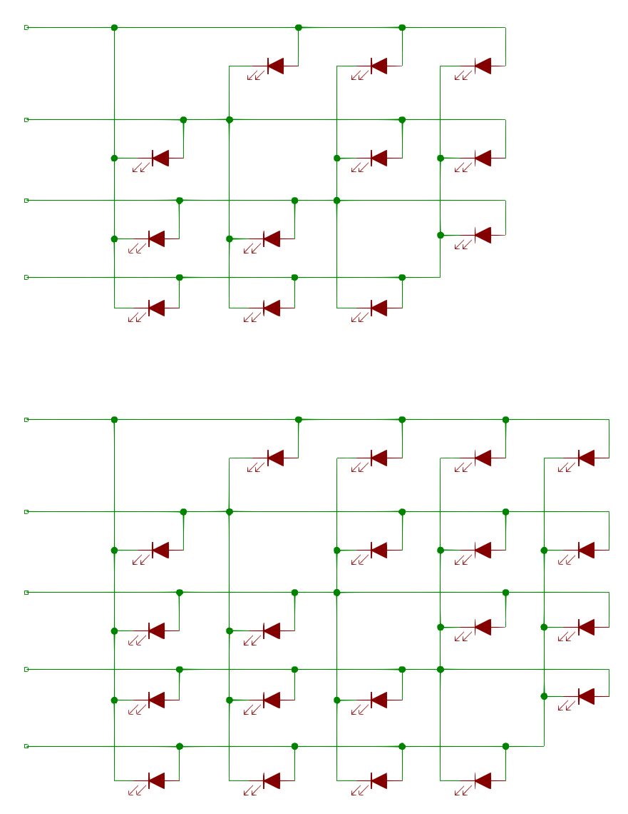
</td>
</tr>
</table>

::: notes
* Encapsulate the previous example inside a function, and then
  call it twice to create two charlieplexed LED arrays.
* Demonstrates hierarchy/encapsulation and parameterization.
* The effort to create the SKiDL code is *much* less than the schematic.
:::

## Example #4

<pre class="sourceCode py">
vdd, gnd = Net('VDD'), Net('GND') # power & ground nets.        
                                                                                   
c = Part('Device','C', TEMPLATE)  # capacitor template.         
                                                                                    
uc = Part('MCU_Microchip_PIC16',                              
          'PIC16F83-XXSO')        # Microcontroller.                                   
uc['VDD, VSS'] += vdd, gnd        # Attach pwr, gnd to uC.      
                                                                                    
c_byp = c(value='10uF')           # Add bypass capacitor.       
c_byp[1,2] += vdd, vss                                          
                                                                                      
xtal = Part('Device','Crystal')   # Crystal.                    
uc['OSC1, OSC2'] += xtal[1,2]     # Attach crystal to uC.       
                                                                                    
c1, c2 = c(2, value='10pF')       # Crystal trim caps.          
c1[1,2] += xtal[1], gnd           # Connect trim caps.          
c2[1,2] += xtal[2], gnd                                         
                                                                                    
chplx_leds(uc['RB[3:0]'])         # 12 charlieplexed LEDs.      
chplx_sws(uc['RA[3:0]'])          # 12 charlieplexed switches.  
</pre>

::: notes
* The charlieplexed switches are just like the charlieplexed LEDs except the
  LED is replaced with a switch and a diode.
* The effort to create SKiDL code is *much, much* less than the schematic.
* Shows the advantages of encapsulation and parameterization.
:::

## Netlist &rarr; Layout
<table>
<tr>
<td class="fragment" style="vertical-align:top;">
<pre class="sourceCode py">
...
chplx_leds(uc['RB[3:0]'])
chplx_sws(uc['RA[3:0]'])

generate_netlist()
</pre>
</td>
<td class="fragment" style="vertical-align:top;">
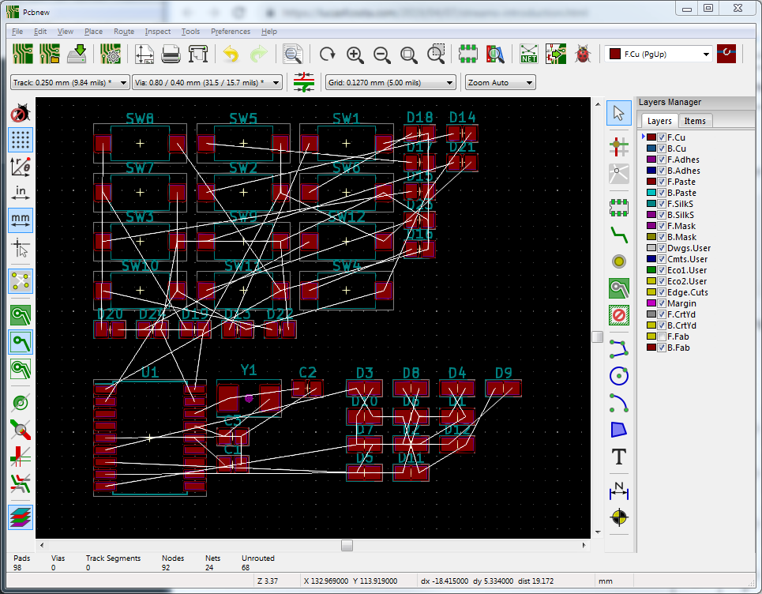
</td>
</tr>
</table>

## Footprints?

Where did the footprints come from?

<pre class="sourceCode py fragment">
uc = Part('MCU_Microchip_PIC16', 'PIC16F83-XXSO',
          footprint=
            "KiCad_V5/Package_SO.pretty:SOIC-18W_7.5x11.6mm_P1.27mm")
</pre>

::: notes
* Footprints are just text strings that locate KiCad footprint files.
* Long and unwieldly. Define in one place and use repeatedly.
* Used to use CVPCB, but it went away.
:::

## Parts?

How did you find the parts?

<pre class="fragment sourceCode python" style="color:lime">
>>> search('pic10')
</pre>

<pre class="fragment sourceCode python" style="color:lime">
WARNING: Could not open directory ''
MCU_Microchip_PIC10.lib: PIC10F220-IMC (512W Flash, 24B SRAM, DFN8)
MCU_Microchip_PIC10.lib: PIC10F320-IMC (512W Flash, 64B SRAM, DFN8)
MCU_Microchip_PIC10.lib: PIC10F220-IOT (512W Flash, 24B SRAM, SOT-23-6)
MCU_Microchip_PIC10.lib: PIC10F204-IMC (512W Flash, 24B SRAM, DFN8)
MCU_Microchip_PIC10.lib: PIC10F320-IP (512W Flash, 64B SRAM, PDIP8)
MCU_Microchip_PIC10.lib: PIC10F204-IOT (512W Flash, 24B SRAM, SOT-23-6)
MCU_Microchip_PIC10.lib: PIC10F220-IP (512W Flash, 24B SRAM, PDIP8)
MCU_Microchip_PIC10.lib: PIC10F320-IOT (512W Flash, 64B SRAM, SOT-23-6)
MCU_Microchip_PIC10.lib: PIC10F200-IP (512W Flash, 24B SRAM, PDIP8)
MCU_Microchip_PIC10.lib: PIC10F204-IP (512W Flash, 24B SRAM, PDIP8)
MCU_Microchip_PIC10.lib: PIC10F200-IOT (512W Flash, 24B SRAM, SOT-23-6)
MCU_Microchip_PIC10.lib: PIC10F200-IMC (512W Flash, 24B SRAM, DFN8)
</pre>

## SKiDL Fixes Common Problems

* Trivialities (Junction dot size? Really!?!)
* Repetitive parts (1000 * cap(value="0.1uF"))
* Mistaken disconnections
* Power flags (`diode['K'].drive=POWER`)
* Version control (diff just works)
* Multiple boards in one project

## Freebies!

* Standard res/cap values (pypi.org/project/eseries)
* Normalizing values (github.com/ulikoehler/UliEngineering)
* `PySpice` - ngspice interface
* `scipy.optimize`

::: notes
* A way to access standard E24, E48 resistor/capacitor values: someone wrote it for me!
* A way to recognize that 4K7, 4.7K and 4700 are all the same value: someone wrote it for me!
* A way to run SPICE simulations from Python: someone wrote it for me!
* A way to optimize the performance of a circuit: someone wrote it for me!
:::

## Generative Circuits

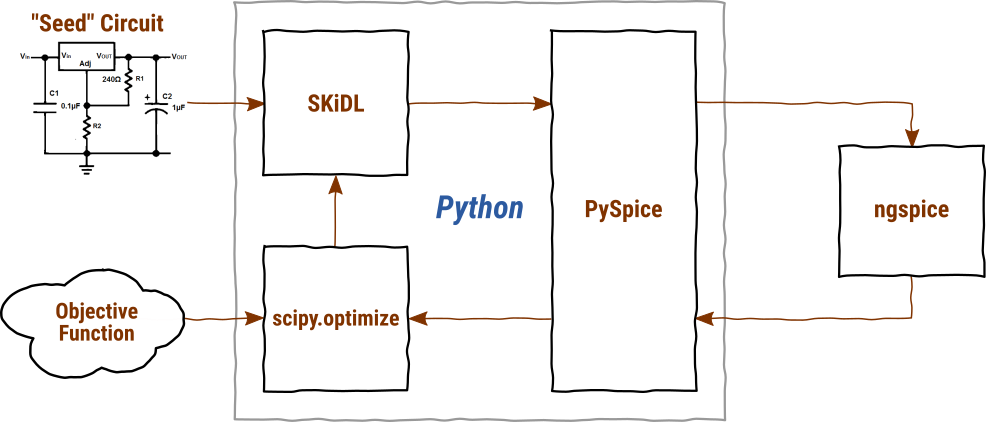

## Multi-Voltage Regulator

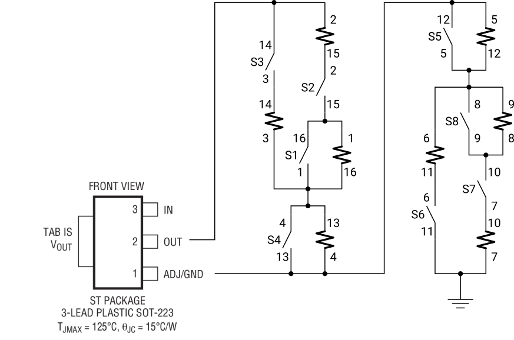

::: notes
* Connect the 8 resistors and 8 switches to generate as many, 0.1V-spaced voltages as
  possible with the adjustable regulator. 
:::

## Machine-Generated Version

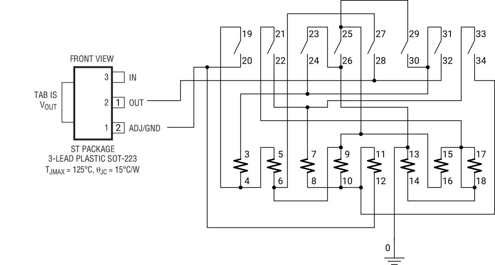

::: notes
* I gave the machine a random arrangement of resistors and switches and said "make it better!"
* This is what it came up with.
:::

## Man vs. Machine

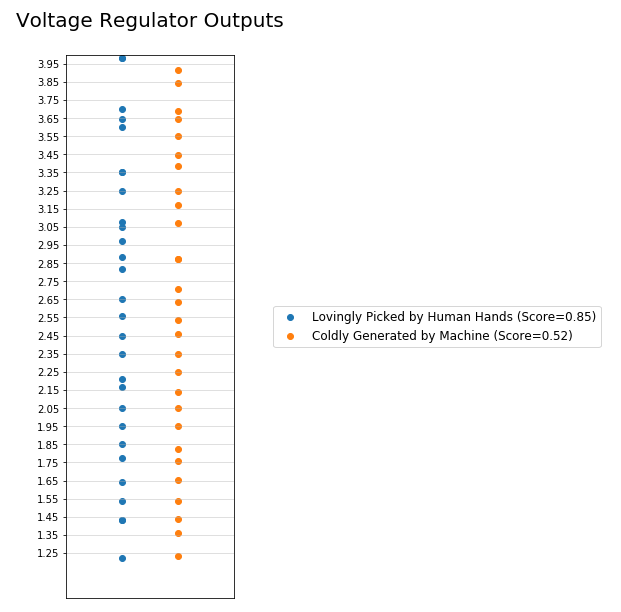

::: notes
* Machine-generated circuit is slightly less clumpy.
* Machine-generated can handle less regular cases like unequal number of switches
  and resistors or different values of resistors.
:::

## Documentation

* Python comments
* Doc strings, Sphinx and autodoc
* Attaching notes to circuits, parts, pins, nets, buses
* Jupyter

::: notes
* Jupyter is the 800-lb gorilla of documentation.
:::

## Jupyter

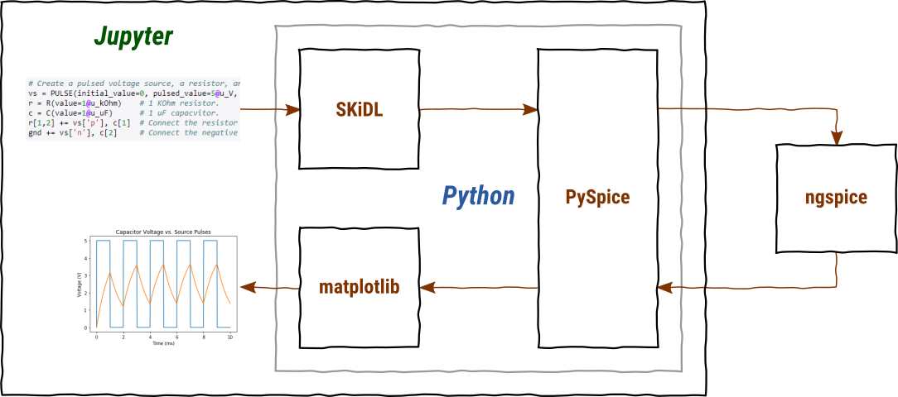

##

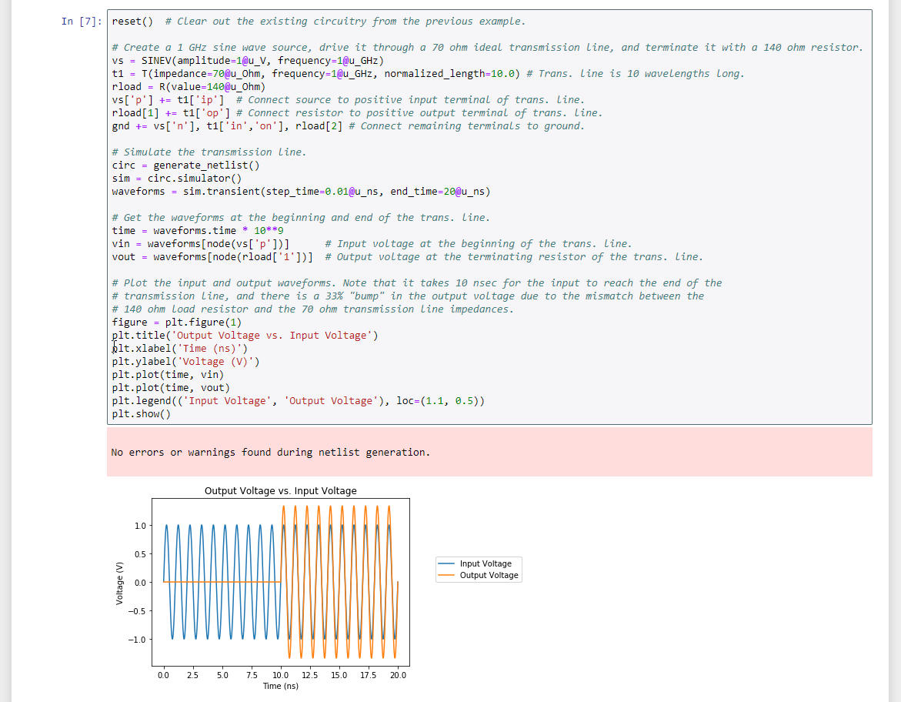

::: notes
* Rich media: pictures, circuit diagrams, videos.
* Include live calculations in your notebook.
* Have your documentation generate your circuit.
* Show the little girl again, but in a playground.
:::

##

::: notes
So where have we ended up? I hope here. The little girl is surrounded by friends.
She's not the center of attention, but that was never the point.
They can play with her toy if they want, or they can do their own thing, if they want.
And that seems like a pretty good situation.
Except for this guy...
:::

##

::: notes
But he's always going to be around. And maybe that's a good thing:
everything has a start. Maybe everything needs an end, too.
Like this talk.
:::

## Playground Rules

* pip install skidl
* Design examples: xesscorp.github.io/skidl
* Netlist converter: netlist_to_skidl
